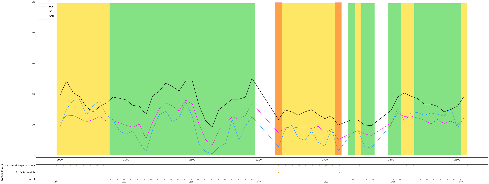
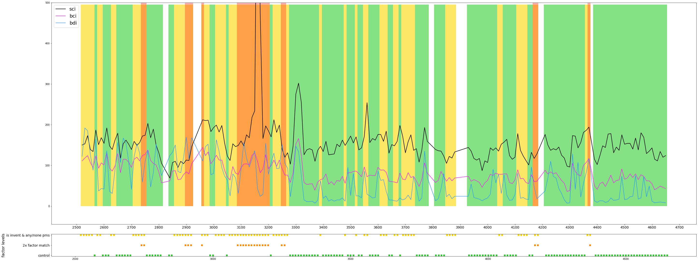
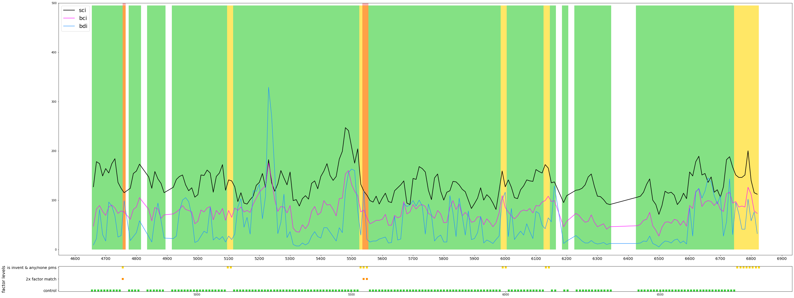
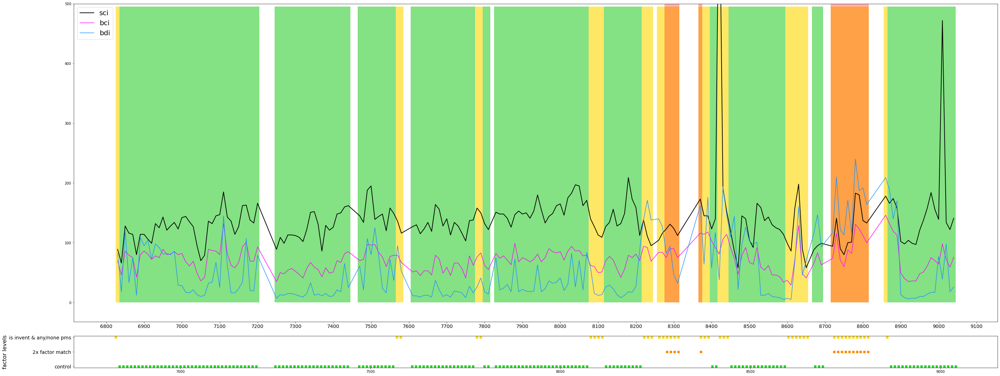
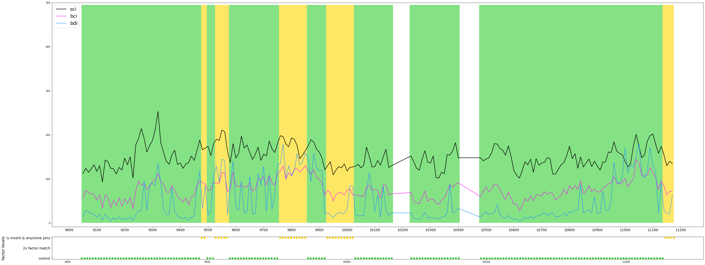
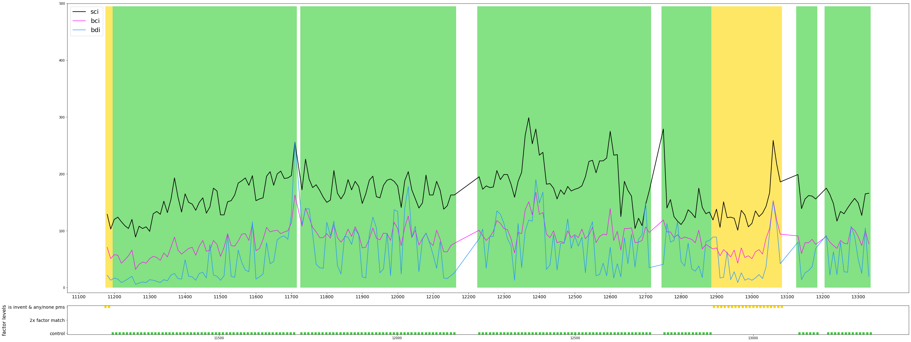

title: md converted thing.
date: 2020-12-19 22:30
author: Alex

```python
import warnings
warnings.filterwarnings('ignore')
import pandas as pd
from matplotlib import pyplot as plt
from math import ceil

VNR = 892

def roundup(x):
    #  round up ticks to next hundred
    return int(ceil(x / 100.0)) * 100

# inject input data as pd dataframes
df = pd.read_csv(f"{VNR}_tsd_parameters.csv")
df2 = pd.read_csv(f"marker_control_{VNR}.csv")
df2_ac_pure = pd.read_csv(f"marker_pure_anticontrol_{VNR}.csv")
df2_ac_mixed  = pd.read_csv(f"marker_mixed_anticontrol_{VNR}.csv")
df4 = pd.read_csv(f"marker_{VNR}.csv")

# parameters
chainage = list(df.Chainage)
x_axis = list(df.lop_lan_med)
sci = list(df.SCI300)
bci = list(df.BCI)
bdi = list(df.BDI)

# markers

# test11
marker_chain = list(df2.Chainage_orig)
# comment out temporarily
#marker_chain = list(df2.lop_lan_med)
height = list(df2.height)
# comment out temporarily
marker_chain_ac = list(df2_ac_pure.Chainage_orig)
# marker_chain_ac = list(df2_ac_pure.lop_lan_med)
height_ac = list(df2_ac_pure.height)
# comment out temporarily
#marker_chain_ac_mixed = list(df2_ac_mixed.lop_lan_med)
marker_chain_ac_mixed = list(df2_ac_mixed.Chainage_orig)
height_acm = list(df2_ac_mixed.height)

size_slice = 200

# Helper splits off the df
def chunk(lst, n):
    """Yield successive n-sized chunks from lst."""
    for i in range(0, len(lst), n):
        yield lst[i:i + n]
def chunk_exec(iterator_toslice, size = 200):
    return [item_1 for item_1 in chunk(iterator_toslice, size)]

#  notice here start and end computed based on chainage
start_of_chain, end_of_chain = chainage[0], chainage[-1]
if start_of_chain > end_of_chain:
    start_of_chain, end_of_chain = chainage[-1], chainage[0]
chainage_range = range(roundup(start_of_chain), roundup(end_of_chain), 100)
```


```python
#  parameters decorated
chainage_sliced = chunk_exec(chainage)
x_axis_sliced = chunk_exec(x_axis)
sci_sliced = chunk_exec(sci)
bci_sliced = chunk_exec(bci)
bdi_sliced = chunk_exec(bdi)
marker_chain_sliced = chunk_exec(marker_chain)
height_sliced = chunk_exec(height)
marker_chain_ac_sliced = chunk_exec(marker_chain_ac)
height_ac_sliced = chunk_exec(height_ac)
marker_chain_ac_mixed_sliced = chunk_exec(marker_chain_ac_mixed)
height_acm_sliced = chunk_exec(height_acm)

#  set heigth ratio using gridspec_kw
width = [1]
heights = [10, 1]
gs_kw = dict(width_ratios=width, height_ratios=heights)  # {'width_ratios': [1], 'height_ratios': [5, 1]}
```


```python
zipped_slices = zip(chainage_sliced, x_axis_sliced, sci_sliced, 
             bci_sliced, bdi_sliced, marker_chain_sliced, 
             height_sliced, marker_chain_ac_sliced, height_ac_sliced,
             marker_chain_ac_mixed_sliced, height_acm_sliced)

def the_plotter(num_figures, value_collection):     
    # chainage, x_axis, sci, bci, bdi, marker_chain, height, 
    # marker_chain_ac, height_ac, marker_chain_ac_mixed, height_acm
    
    chainage = value_collection[0]
    #x_axis = value_collection[1]
    #chainage = value_collection[1]  #  put chainage in place of x_axis
    sci = value_collection[2]
    bci = value_collection[3]
    bdi = value_collection[4]
    marker_chain = value_collection[5]
    height = value_collection[6]
    marker_chain_ac = value_collection[7]
    height_ac = value_collection[8]
    marker_chain_ac_mixed = value_collection[9] 
    height_acm =  value_collection[10]
    
    f, (ax1, ax2) = plt.subplots(2, 1, constrained_layout=True, 
                                 sharey=False, figsize=(40, 15), 
                                 gridspec_kw=gs_kw)

    ax1.plot(chainage, sci, color="black", linewidth= 2.0)
    ax1.plot(chainage, bci, color="magenta")
    ax1.plot(chainage, bdi, color="dodgerblue")  # indigo
    ax1.set_ylim(top=500)
    ax1.legend(('sci', 'bci', 'bdi'), loc=2, prop={'size': 20})  #  legend size set
    
    ax1.set_xticks(list(chainage_range))
    ax1.set_xticklabels(list(chainage_range), fontsize=14)  # list(xticks_computation(chainage_range)
   
    # ===================================================
    # PLOT 2
    # control 
    ax2.plot(marker_chain, height, linestyle='None', color="limegreen", marker='s', markersize=6)
    # 2x factor match
    ax2.plot(marker_chain_ac, height_ac, linestyle='None', color="darkorange", marker='s', markersize=6)
    # is invent & any pms
    ax2.plot(marker_chain_ac_mixed, height_acm, linestyle='None', color="gold", marker='s', markersize=6)
    ax2.yaxis.set_ticks([1,2,3])
    ax2.set_yticklabels(['control','2x factor match','is invent & any/none pms'], fontsize=14)
    ax2.set_ylabel('factor levels', fontsize = 16)
    
    #  =========================================================
    # BARS
    # add a bar chart to the upper subplot
    width = 10    #  the width of the bars, approx(end_of_chain - start_of_chain)/300
    x = marker_chain
    x2 = marker_chain_ac
    x3 = marker_chain_ac_mixed
    y = [i*495 for i in height]
    y2 = [i*250 for i in height_ac]
    y3 = [i*165 for i in height_acm]
    # control 
    rects1 = ax1.bar(x, y, width, color='limegreen', alpha = 0.6)    
    #  is invent & any/none pms
    rects3 = ax1.bar(x3, y3, width, color='gold', alpha = 0.6)
    # 2x factor match
    rects2 = ax1.bar(x2, y2, width, color='red', alpha = 0.3)  # navy
    
    plt.savefig(f"roadname{VNR}part{num_figures}_slice2000_v20200507.png")
    

# TO DO refactor as main
counter1=0
for num_cnt_main, chunk_element in reversed(list(enumerate(zipped_slices))):
    counter1 += 1
    the_plotter(counter1, chunk_element)
```




















```python
# 2x factor match = type of anti ktrl, where  pms = true and sweco invent = true. (deprecated name 'factor pure').
# is invent & any pms. Points where invent = true regardless of whether pms true or false (it means pms can both be true and false), (deprecated name 'factor mix').

```


```python

```
